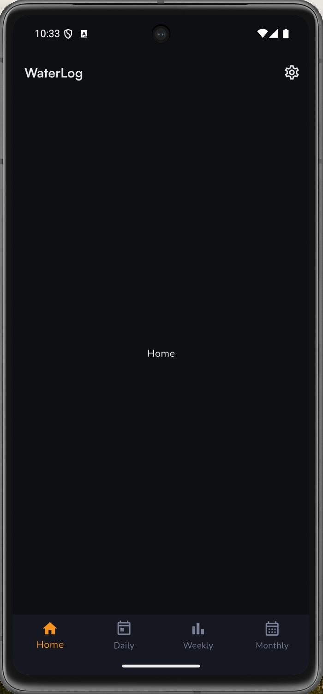
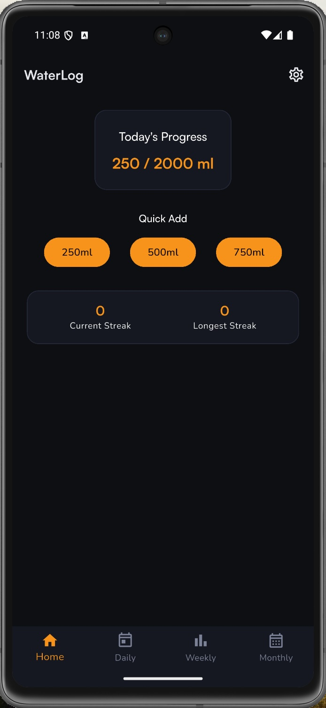
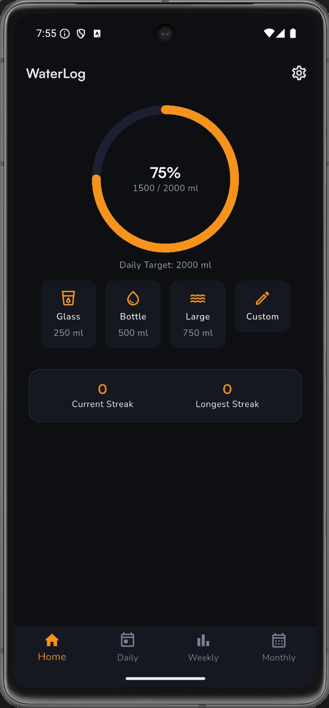
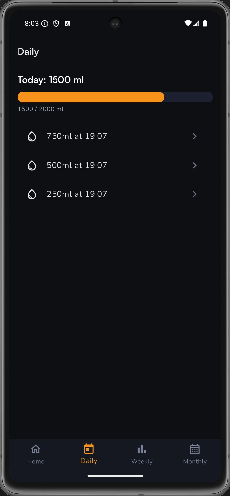
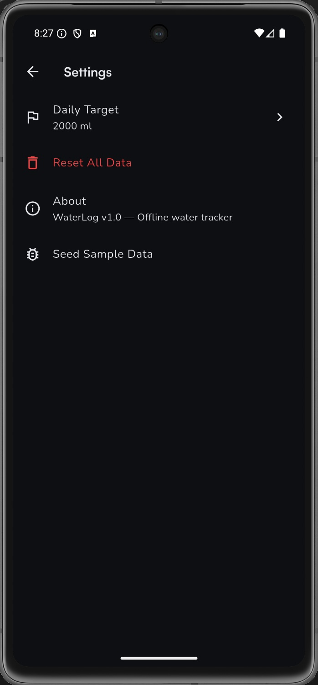

# WaterLog Delivery Overview (D0-D5)

This document summarizes what was delivered in each PRD deliverable milestone using:
- `docs/PRD.md`
- branch history and milestone commits in this repo.

## Branch and Milestone Map

| Deliverable | Branch | Compare URL | Summary |
|---|---|---|---|
| D0 | `000-flutter-scaffold` | `https://github.com/evalincius/odd-water-tracker-mob-app/compare/000-flutter-scaffold` | Flutter scaffold, routing, theme, Riverpod bootstrap, Drift DB foundation |
| D1 | `001-initial-screens-db-setup` | `https://github.com/evalincius/odd-water-tracker-mob-app/compare/001-initial-screens-db-setup` | App-specific screens + drift schema (water_entries, user_settings) + repositories |
| D2 | `002-home-screen` | `https://github.com/evalincius/odd-water-tracker-mob-app/compare/002-home-screen` | Home screen with progress ring, quick-add buttons, custom amount, streaks |
| D3 | `003-daily-view` | `https://github.com/evalincius/odd-water-tracker-mob-app/compare/003-daily-view` | Daily view with entry list, progress bar, delete flow |
| D4 | `004-weekly-summary` | `https://github.com/evalincius/odd-water-tracker-mob-app/compare/004-weekly-summary` | Weekly Summary bar chart + Monthly Patterns calendar heatmap |
| D5 | `005-settings` | `https://github.com/evalincius/odd-water-tracker-mob-app/compare/005-settings` | Settings screen, integration tests, seed data tools, release polish |

## D0 — Flutter Scaffold, Routing, Riverpod, Drift Foundation

PRD intent:
- runnable Flutter baseline
- tab navigation with placeholder screens
- Riverpod bootstrap
- Drift DB open/migration foundation

Delivered in branch `000-flutter-scaffold`:
- App bootstrap and structure (`lib/main.dart`, `lib/app.dart`).
- Router/provider wiring (`lib/router/app_router.dart`, `lib/providers/database_provider.dart`).
- Database foundation with empty schema (`lib/db/app_database.dart`, `lib/db/app_database.g.dart`).
- Theme system: colours, typography, spacing (`lib/theme/app_colors.dart`, `lib/theme/app_theme.dart`, `lib/theme/app_typography.dart`, `lib/theme/app_spacing.dart`).
- Bottom navigation shell (`lib/widgets/scaffold_with_nav_bar.dart`).
- Placeholder screens: Home, Daily, Weekly, Monthly, Settings.
- Smoke tests for app boot, navigation, DB init, and theme (`test/`).

## D1 — App-Specific Screens + Database Schema + Repositories

PRD intent:
- replace placeholders with WaterLog screen shells
- add app schema (`water_entries`, `user_settings`)
- repository layer with CRUD + stats + validation

Delivered in branch `001-initial-screens-db-setup`:
- Drift schema with `water_entries` and `user_settings` tables, constraints and indexes (`lib/db/tables/water_entries.dart`, `lib/db/tables/user_settings.dart`, `lib/db/app_database.dart`).
- Repository layer:
  - `lib/repositories/water_entry_repository.dart` (add, list by date, delete)
  - `lib/repositories/water_stats_repository.dart` (today total, daily totals, weekly summary, monthly totals, streaks)
  - `lib/repositories/settings_repository.dart` (get/set target)
- Riverpod providers for repositories and settings (`lib/providers/repository_providers.dart`, `lib/providers/settings_providers.dart`, `lib/providers/water_providers.dart`).
- Screen shells with basic state wiring for Home, Daily, Weekly, Monthly, Settings.
- Unit tests for all repositories (`test/repositories/`).

## D2 — Home Screen + Fast Logging UX

PRD scope:
- FR-002/004/005/010/011 (+ FR-012 for target display).

Delivered in branch `002-home-screen`:
- Fully functional Home screen with progress ring, streak counters, quick-add buttons (`lib/screens/home_screen.dart`).
- Extracted reusable widgets:
  - `lib/widgets/progress_ring.dart` (circular progress indicator)
  - `lib/widgets/quick_add_button.dart` (250/500/750ml quick-add)
  - `lib/widgets/custom_amount_sheet.dart` (custom amount bottom sheet with validation)
  - `lib/widgets/streak_card.dart` (current + longest streak display)
- Input validation (1-5000ml bounds, numeric check, inline error messages).
- Widget and screen tests (`test/screens/home_screen_test.dart`, `test/widgets/`).

## D3 — Daily View + Delete Flow

PRD scope:
- FR-006/007/011.

Delivered in branch `003-daily-view`:
- Daily screen with today's total, progress bar, and timestamped entry list (`lib/screens/daily_screen.dart`).
- Progress bar widget (`lib/widgets/progress_bar.dart`).
- Entry list rendered newest-first as "{amount}ml at HH:mm".
- Tap entry to delete with confirmation; totals update immediately.
- Screen and widget tests (`test/screens/daily_screen_test.dart`, `test/widgets/progress_bar_test.dart`).

## D4 — Weekly Summary + Monthly Patterns

PRD scope:
- FR-008/009/011.

Delivered in branch `004-weekly-summary`:
- Weekly Summary screen with 7-day bar chart, target reference line, average/day, days hit target (`lib/screens/weekly_screen.dart`).
- Monthly Patterns screen with calendar heatmap, colour intensity by total, target tick markers, tap tooltip (`lib/screens/monthly_screen.dart`).
- Chart and heatmap widgets:
  - `lib/widgets/weekly_bar_chart.dart`
  - `lib/widgets/weekly_stats_row.dart`
  - `lib/widgets/calendar_heatmap.dart`
- Additional water providers for weekly/monthly data (`lib/providers/water_providers.dart`).
- Screen and widget tests (`test/screens/weekly_screen_test.dart`, `test/screens/monthly_screen_test.dart`, `test/widgets/`).

## D5 — Settings + Polish, QA, Release Readiness

PRD scope:
- FR-012 + NFRs + release checklist.

Delivered in branch `005-settings`:
- Settings screen with edit daily target via bottom sheet (`lib/screens/settings_screen.dart`, `lib/widgets/edit_target_sheet.dart`).
- UX polish across Home widgets (progress ring, quick-add buttons, streak card, custom amount sheet).
- Integration tests for key journeys:
  - `integration_test/quick_add_test.dart`
  - `integration_test/custom_add_test.dart`
  - `integration_test/delete_entry_test.dart`
  - `integration_test/charts_render_test.dart`
  - `integration_test/change_target_test.dart`
- Debug seed data tool for development (`lib/debug/seed_data.dart`).
- Settings and edit target tests (`test/screens/settings_screen_test.dart`, `test/widgets/edit_target_sheet_test.dart`).

## Change Magnitude Snapshot (Milestone Commits)

- D0 (`13a47c2`): 39 files changed, 959 insertions, 113 deletions.
- D1 (`0bd47fd`): 48 files changed, 6122 insertions, 24 deletions.
- D2 (`1cf24fc`): 26 files changed, 1327 insertions, 199 deletions.
- D3 (`1772a65`): 8 files changed, 1036 insertions, 5 deletions.
- D4 (`f1c4dff`): 13 files changed, 1050 insertions, 27 deletions.
- D5 (`bcedd36`): 25 files changed, 1814 insertions, 98 deletions.

## High-Level Outcome

The app progressed linearly from scaffold to full offline v1 feature set described in `docs/PRD.md`, with each deliverable implemented on its own milestone branch and merged forward into the current D5 branch. The complete logging-to-insights loop is in place: quick-add and custom logging (D2), daily review and correction (D3), weekly and monthly pattern visualisation (D4), and target management with integration test coverage (D5).
