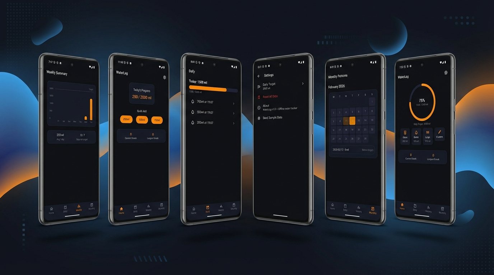

# What You Will Build: WaterLog — A Complete Flutter Mobile App

A hands-on project where you will build a **production-quality, offline-first water intake tracker** from scratch using Flutter, entirely with AI-assisted development (Claude Code + spec-kit workflow).

---

## The App at a Glance

WaterLog lets users track their daily water intake, review history, discover patterns, and build streaks — all without accounts, ads, or cloud services. Every byte of data stays on the device.



---

## Tech Stack

| Layer | Technology | Why |
|-------|-----------|-----|
| **Framework** | Flutter 3.38+ / Dart 3.10+ | Cross-platform (iOS + Android) from a single codebase |
| **Navigation** | go_router | Declarative routing with deep link support and bottom nav integration |
| **State Management** | Riverpod | Type-safe, testable, auto-disposing providers with code generation |
| **Database** | Drift (SQLite) | Compile-time-safe SQL, code generation, in-memory testing |
| **Charts** | fl_chart | Customisable bar charts with Flutter-native rendering |
| **Date Formatting** | intl | Locale-aware date/time display |
| **IDs** | uuid | Collision-free primary keys |
| **Fonts** | Satoshi + Nunito | Bundled custom typography (no runtime downloads) |
| **Backend** | None | Fully offline — zero network calls, verified by automated audit |

---

## Features & Functionality

### 1. Home Dashboard
- Circular progress ring showing today's intake vs. daily target (with percentage)
- Quick-add buttons for common amounts: 250ml (Glass), 500ml (Bottle), 750ml (Large)
- Custom amount input via bottom sheet (1–5000ml with validation)
- Streak card displaying current and longest streaks
- Empty state with call-to-action for first-time users

### 2. Daily Review
- Today's total with linear progress bar (turns green when target is met)
- Timestamped list of all entries for the day (newest first)
- Tap-to-delete flow with confirmation dialog
- Empty state prompting user to log from Home tab

### 3. Weekly Summary
- **7-day bar chart** — last week's daily totals with target reference line
- **Stats row** — average daily intake + number of days target was hit
- Day-labelled x-axis (Mon–Sun)
- Empty state when no data exists for the week

### 4. Monthly Patterns
- **Calendar heatmap** — month grid with colour intensity based on consumption (5 opacity levels)
- **Target markers** — checkmark overlay on days where target was met
- **Tap tooltips** — tap any day cell to see that day's total and target status
- Empty state when no data exists for the month

### 5. Settings
- **Edit daily target** — bottom sheet editor with validation (250–10,000ml range)
- **Reset all data** — destructive action with confirmation dialog (deletes entries, resets target to 2000ml)
- **About section** — app version and description

### 6. Developer & QA Tools
- Seed data generator: populate 30 days of realistic sample entries (debug mode only, via Settings)
- Integration tests covering full user journeys (quick-add, custom amount, delete, chart rendering, target change)
- Network audit: zero HTTP calls exist in the codebase

---

## Architecture Overview

```
┌─────────────────────────────────────────────────────┐
│                     Screens                          │
│  Home  │  Daily  │  Weekly  │  Monthly  │  Settings  │
├─────────────────────────────────────────────────────┤
│                     Widgets                          │
│  ProgressRing  │  ProgressBar  │  QuickAddButton     │
│  WeeklyBarChart │ CalendarHeatmap │ StreakCard        │
│  CustomAmountSheet │ EditTargetSheet │ WeeklyStatsRow │
├─────────────────────────────────────────────────────┤
│               Riverpod Providers                     │
│  todayTotal │ todayEntries │ streaks                  │
│  weeklySummary │ monthlyTotals │ dailyTarget          │
├─────────────────────────────────────────────────────┤
│                 Repositories                         │
│  WaterEntryRepository │ WaterStatsRepository         │
│  SettingsRepository   │ Validation & Constraints     │
├─────────────────────────────────────────────────────┤
│              Drift Database (SQLite)                 │
│  water_entries table │ user_settings table            │
│  UUID keys │ ISO 8601 timestamps │ CHECK constraints  │
└─────────────────────────────────────────────────────┘
```

---

## Project Structure

```
lib/
├── main.dart                          # App entry point
├── app.dart                           # Root MaterialApp.router
├── router/app_router.dart             # go_router config (bottom nav + routes)
├── db/
│   ├── app_database.dart              # Drift DB + schema + migrations
│   └── tables/
│       ├── water_entries.dart         # Entry table (id, timestamp, amount, date)
│       └── user_settings.dart         # Settings table (daily target)
├── repositories/
│   ├── water_entry_repository.dart    # CRUD: add, list by date, delete
│   ├── water_stats_repository.dart    # Aggregations: totals, streaks, summaries
│   └── settings_repository.dart       # Target get/set, reset all data
├── providers/
│   ├── database_provider.dart         # DB singleton
│   ├── repository_providers.dart      # Repository instances
│   ├── water_providers.dart           # Today total, entries, streaks, weekly, monthly
│   └── settings_providers.dart        # Daily target provider
├── screens/
│   ├── home_screen.dart               # Progress ring + quick-add + streaks
│   ├── daily_screen.dart              # Entry list + progress bar + delete
│   ├── weekly_screen.dart             # Bar chart + stats row
│   ├── monthly_screen.dart            # Calendar heatmap with tooltips
│   └── settings_screen.dart           # Target edit + reset + about
├── theme/
│   ├── app_colors.dart                # Brand orange palette, dark mode tokens
│   ├── app_typography.dart            # Satoshi + Nunito type scale
│   ├── app_spacing.dart               # 4px grid, radii, touch targets
│   └── app_theme.dart                 # ThemeData (dark, Material 3)
├── widgets/                           # Reusable UI components
│   ├── scaffold_with_nav_bar.dart
│   ├── progress_ring.dart
│   ├── progress_bar.dart
│   ├── quick_add_button.dart
│   ├── custom_amount_sheet.dart
│   ├── streak_card.dart
│   ├── edit_target_sheet.dart
│   ├── weekly_bar_chart.dart
│   ├── weekly_stats_row.dart
│   └── calendar_heatmap.dart
└── debug/seed_data.dart               # 30-day sample data generator

test/                                  # Unit, widget, and screen tests
integration_test/                      # 5 E2E user journey tests
```

---

## How You Will Build It: 6 Deliverables

You will develop the app incrementally across 6 deliverables, each on its own branch. This mirrors a real-world agile workflow and teaches you how to break a project into manageable units.

| Deliverable | What You Will Build | Key Skills You Will Practise |
|-------------|---------------|---------------------|
| **D0** — Scaffold & Nav | Flutter project, go_router, bottom tabs, theme, fonts, Drift foundation | Project setup, routing, theming, ORM bootstrap |
| **D1** — Schema & Repos | water_entries/user_settings tables, CRUD + stats repositories, provider wiring | Data modelling, code generation, validation |
| **D2** — Home Screen | Progress ring, quick-add buttons, custom amount sheet, streak card | Custom painting, bottom sheets, input validation |
| **D3** — Daily View | Entry list with timestamps, progress bar, delete with confirmation | List rendering, state management, destructive UX |
| **D4** — Weekly & Monthly | 7-day bar chart, stats row, calendar heatmap with intensity | Chart rendering, data aggregation, colour mapping |
| **D5** — Settings & Polish | Target editor, reset data, integration tests, seed data, release readiness | Settings UX, E2E testing, QA automation |

---

## Key Patterns Worth Studying

| Pattern | Where | Why It Matters |
|---------|-------|---------------|
| **Repository pattern** | `repositories/` | Isolates data access from UI; all DB logic in one layer |
| **Provider invalidation** | `providers/water_providers.dart` | Ensures screens refresh after data mutations |
| **Custom painting** | `widgets/progress_ring.dart` | Canvas-based circular progress indicator |
| **Calendar heatmap** | `widgets/calendar_heatmap.dart` | Opacity-mapped colour intensity from raw data |
| **Streak algorithm** | `repositories/water_stats_repository.dart` | Efficient current + longest streak in a single pass |
| **Multi-layer validation** | UI → Repository → DB CHECK | Input bounds enforced at every layer |
| **In-memory DB testing** | `test/db/` | Fresh SQLite per test via `NativeDatabase.memory()` |
| **StatefulShellRoute** | `router/app_router.dart` | Preserves tab state across bottom nav switches |

---

## What's Intentionally Out of Scope

This is a focused v1. The following are deliberately excluded:

- User accounts / authentication / cloud sync
- Beverage types (coffee, tea, juice — water only)
- Reminders / push notifications
- Wearable integrations (Apple Health, Google Fit)
- Data export (CSV, JSON)
- Light mode (dark theme only in v1)
- Widget / Watch complications
- DST-aware timestamp handling (documented limitation)
